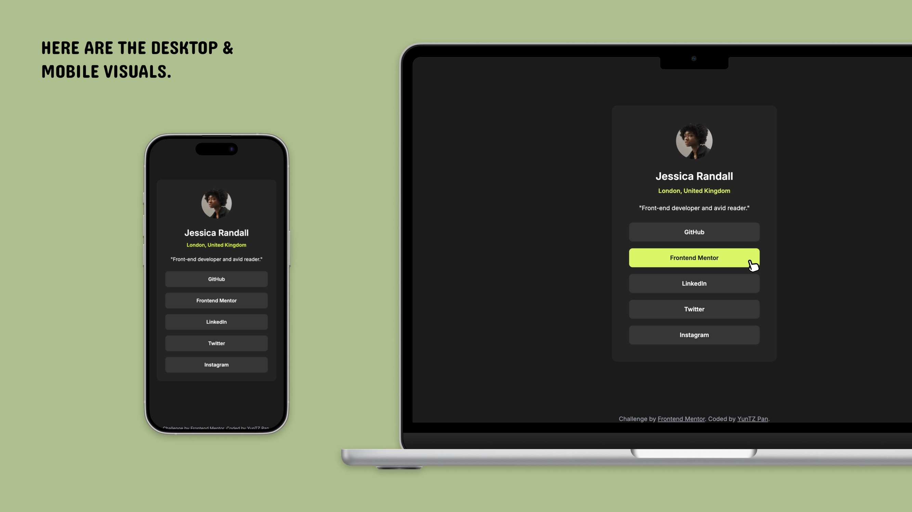

# Frontend Mentor - Social links profile solution

This is a solution to the [Social links profile challenge on Frontend Mentor](https://www.frontendmentor.io/challenges/social-links-profile-UG32l9m6dQ). Frontend Mentor challenges help you improve your coding skills by building realistic projects.

## Table of contents

- [Overview](#overview)
  - [The challenge](#the-challenge)
  - [Screenshot](#screenshot)
  - [Links](#links)
- [My process](#my-process)
  - [Built with](#built-with)
  - [What I learned](#what-i-learned)
  - [Continued development](#continued-development)
  - [Useful resources](#useful-resources)
- [Author](#author)
- [Acknowledgments](#acknowledgments)

## Overview

### The challenge

Users should be able to:

- See hover and focus states for all interactive elements on the page

### Screenshot



### Links

- Solution URL: [solution URL here](https://github.com/yyuntzpan/social-links-profile/tree/main/src/app)
- Live Site URL: [live site URL here](https://social-links-profile-tau-gray.vercel.app/)

## My process

### Built with

- Semantic HTML5 markup
- CSS custom properties
- Flexbox
- Mobile-first workflow
- [React](https://reactjs.org/) - JS library
- [Next.js](https://nextjs.org/) - React framework
- [tailwind css](https://tailwindcss.com/) - For styles


### What I learned

這次嘗試使用 Next.js 開發 React 專案，並搭配 Tailwind CSS 進行樣式設定。我學到了一些設定的方法，例如以下的代碼：

This time, I tried using Next.js to develop a React project and used Tailwind CSS for styling. I learned some configuration methods, such as the following code:

tailwind.config
```js
const config: Config = {
  theme: {
    extend: {
      colors:{
        'green': "hsl(75, 94%, 57%)",
        'white': "hsl(0, 0%, 100%)",
        'grey-700': "hsl(0, 0%, 20%)",
        'grey-800': "hsl(0, 0%, 12%)",
        'grey-900': "hsl(0, 0%, 8%)",
      },
      fontFamily: {
        sans: ['Inter', 'sans-serif'],
      },
    },
  },
  plugins: [],
};
export default config;
```
layout.tsx
```js
import { Inter } from "next/font/google";

const inter = Inter({
  subsets: ["latin"],
  display: "swap",
  weight: ["400", "600", "700"],
  variable: "--font-inter",
});
```
### Continued development

我想要繼續練習使用 Tailwind CSS，特別是在設定自訂樣式及熟悉語法，目標是加快切版的速度。此外，我也會在下一個專案中探索使用 Vite + Vue，以提升個人前端開發的知識廣度。

- Tailwind CSS:

  - Continue practicing with Tailwind CSS, particularly in setting up custom styles.
  - Become more familiar with its syntax to speed up the process of building layouts.

- Vite + Vue:

  - Explore using Vite + Vue in my next project to broaden my knowledge in front-end development.


### Useful resources

- [Tailwind CSS docs](https://tailwindcss.com/docs/installation) - This resource helped me set up Tailwind and look up the corresponding native CSS.

## Author

- Github - [YunTZ Pan](https://github.com/yyuntzpan)
- Frontend Mentor - [@yyuntzpan](https://www.frontendmentor.io/profile/yyuntzpan)


## Acknowledgments

This section is currently empty, but I’m keeping it here in case I need to acknowledge someone in the future.

